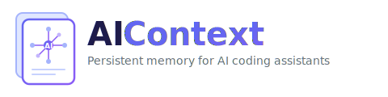

<p align="center">
  
</p>

<p align="center">
  <a href="https://www.npmjs.com/package/@zahardev/aicontext"></a>
</p>

**Tired of explaining your project to AI assistants over and over again?**

AIContext gives your AI coding assistants persistent memory about your project — your tech stack, coding standards, folder structure, and workflows. Set it up once, and every AI session starts with full context.

**Works with any language or framework** — PHP, Python, JavaScript, TypeScript, Rust, Go, and more. Includes detection prompts for Laravel, WordPress, Django, Next.js, NestJS, Flutter, and other popular frameworks.

**Supports multiple AI tools** — Claude Code, Codex, Cursor, and GitHub Copilot.

## Features

- **Persistent project context** — the AI auto-analyzes your codebase on first run and remembers your tech stack, architecture, and conventions across sessions
- **Three-layer context model** — specs (requirements), tasks (plan + progress), and briefs (working knowledge) keep the AI aligned across sessions and features
- **Structured discovery** — `/start-feature` runs a thorough interview before any code is written, producing a spec and task with a step-by-step plan
- **Automated execution** — `/run-steps` implements all steps with built-in review and test loops, so you don't have to manually trigger each step
- **Session continuity** — briefs capture patterns, gotchas, and decisions as the AI works. Start a new session, run `/check-task`, and the AI picks up where it left off
- **Built-in code review** — review uncommitted changes or full branch diffs, cross-referenced against task requirements (Claude Code)
- **GitHub PR workflow** — draft PRs from task context, automate review-fix cycles with `/gh-review-fix-loop` (Claude Code)
- **Specialized agents** — dedicated reviewer, test runner, standards checker, and researcher run in parallel without consuming your main conversation (Claude Code)
- **Browser inspection** — `/web-inspect` lets the AI open pages, check console errors, interact with elements, and capture screenshots — useful for debugging UI issues, manual testing, and verifying fixes visually
- **Safety guardrails** — blocks destructive commands, enforces TDD, and requires explicit permission before implementation starts

## How It Works

Each AI tool has an **entry point file** that loads shared rules and project context from `.aicontext/` at session start.

| Tool | Entry Point | Format |
|------|-------------|--------|
| Claude Code | `.claude/CLAUDE.md` | Markdown |
| Codex | `.codex/skills/` | Markdown (skills only) |
| Cursor | `.cursor/rules/*.mdc` | MDC (Markdown + YAML) |
| GitHub Copilot | `.github/copilot-instructions.md` | Markdown |

## Development Model

AIContext organizes work in three layers:

```
Spec (what & why)  →  Task (how & progress)  →  Brief (working knowledge)
```

| Layer | File | Purpose | Persisted |
|-------|------|---------|-----------|
| **Spec** | `.aicontext/specs/spec-*.md` | Requirements, decisions, non-goals | Committed |
| **Task** | `.aicontext/tasks/*.md` | Step-by-step plan with checkboxes | Committed |
| **Brief** | `.aicontext/data/brief/brief-*.md` | Patterns, gotchas, file references accumulated during work | Gitignored |

**Specs** define *what* to build and *why*. They contain no file paths or implementation details — they survive refactors. One spec can have multiple tasks.

**Tasks** define *how* to build it. Each step is a checkbox. The AI checks them off as it goes.

**Briefs** are the AI's working memory. After each step, the AI appends what it learned. If you start a new session, `/check-task` reads all three layers and the new AI is caught up — no knowledge is lost.

Learn more in the [development model guide](docs/development-model.md).

### Typical Flow

```
/start-feature  →  Interview  →  Spec + Task(s)
                                      ↓
                                /run-steps  →  Implement + Review + Test (automated per step)
                                      ↓
                                /finish-task  →  Sync spec, update worklog, handle git
```

For large features, `/start-feature` proposes splitting work into multiple tasks. You can also create tasks later from an existing spec using `/plan-tasks`.

| Skill | When to use |
|-------|-------------|
| `/start-feature` | Starting new work — structured interview, creates spec + task(s) |
| `/plan-tasks` | Creating tasks from an existing spec — proposes breakdown, creates task files |
| `/run-steps` | Executing the plan — automates all steps with review-fix loops |
| `/check-task` | Resuming a session — reads spec → brief → task, surfaces where you left off |
| `/finish-task` | Closing out — syncs spec, writes completion notes, updates worklog |
| `/do-it` | Quick addition — turns a conversation into a task step, updates spec and brief, implements it |
| `/align-context` | Housekeeping — updates all context files to reflect current state |
| `/gh-review-fix-loop` | After PR — automates the review-fix-push cycle |

See the [full skills reference](docs/skills.md) for detailed descriptions of every skill.

## Requirements

- Node.js 14.14.0 or higher (for npm install only — not needed for [manual copy](#option-c-manual-copy))

## Installation

### Option A: Global Install (Recommended)

```bash
npm install -g @zahardev/aicontext
cd /path/to/your-project
aicontext init
```

### Option B: npx (One-time use)

```bash
cd /path/to/your-project
npx @zahardev/aicontext init
```

You can also specify the project path explicitly: `aicontext init /path/to/your-project`

**Note:** If `.claude/`, `.cursor/`, or `.aicontext/` already exist, you'll be prompted before overwriting. If you use git, uncommitted changes can be reverted with `git checkout`.

### Option C: Manual Copy

If you prefer not to use npm, clone the [GitHub repository](https://github.com/zahardev/aicontext) and copy the needed files:

```bash
# Clone to a temporary location
git clone https://github.com/zahardev/aicontext.git /tmp/aicontext

# Copy needed files to your project
cd /path/to/your-project
cp -r /tmp/aicontext/.aicontext .

# Copy entry points for your AI tool(s) — pick what you use:
cp -r /tmp/aicontext/.claude .   # Claude Code
cp -r /tmp/aicontext/.cursor .   # Cursor
cp -r /tmp/aicontext/.github .   # GitHub Copilot

# Clean up
rm -rf /tmp/aicontext
```

### Quick Start

After installing, start a session to let the AI learn your project:

1. **Claude Code:** Type `/start`
2. **Codex:** Type `Use start`
3. **Cursor / Copilot:** Paste the contents of `.aicontext/prompts/start.md`

Run `/aic-help` (or `use aic-help`) for a guided quickstart with typical workflows and best practices.

On the first run, the AI will analyze your codebase and generate `project.md` (tech stack, architecture, conventions), `structure.md` (commands, folder layout), and `worklog.md` (feature/task status). These persist across sessions, so every future session starts with full context automatically.

When you're ready to start building, use `/start-feature` (Claude Code), `Use start-feature` (Codex), or paste `.aicontext/prompts/start-feature.md` (Cursor/Copilot) to kick off the structured planning flow.

### What `aicontext init` Creates

The command creates the following in your project:

| Path | Purpose |
|------|---------|
| `.aicontext/` | Framework files (rules, prompts, templates, scripts) |
| `.claude/CLAUDE.md` | Entry point for Claude Code |
| `.claude/agents/` | Predefined subagents for Claude Code |
| `.claude/skills/` | Invocable skills (`/command`) for Claude Code |
| `.codex/skills/` | Invocable skills for Codex |
| `.cursor/rules/` | Entry point for Cursor |
| `.github/copilot-instructions.md` | Entry point for GitHub Copilot |

## Structure

```text
.aicontext/
├── rules/              # AI behavior rules (process, standards)
├── prompts/            # Universal prompts (source of truth for all instructions)
├── templates/          # Templates for spec, task, brief, project, etc.
├── examples/           # Example configs (GitHub repo only)
├── specs/              # Feature specs (requirements, decisions, non-goals)
├── tasks/              # Task tracking files (plan steps, progress)
├── scripts/            # Tool-agnostic PR workflow scripts
├── data/
│   └── brief/          # Session brief files (gitignored)
├── project.md          # [Generated] Project-specific context
├── structure.md        # [Generated] Commands and folder structure
├── worklog.md          # [Generated] Spec and task status tracking
├── local.md            # Personal settings (gitignored)
└── readme.md           # Framework documentation

.claude/
├── CLAUDE.md           # Claude Code entry point
├── agents/             # Predefined subagents
└── skills/             # Invocable skills (/start, /check-task, etc.)

.codex/
└── skills/             # Invocable skills for Codex

.cursor/                # Cursor entry point
.github/                # GitHub Copilot entry point
```

Example configurations are available in the [GitHub repository](https://github.com/zahardev/aicontext/tree/main/.aicontext/examples).

## Workflow

> **Skill invocation:** Claude Code uses `/skill-name`, Codex uses `Use skill-name`, Cursor/Copilot paste the prompt file from `.aicontext/prompts/`.

### New Feature

1. **`/start-feature`** — structured discovery interview → creates spec + task(s)
2. **`/run-steps`** — executes all steps automatically with review-fix loops
3. **`/finish-task`** — syncs spec, updates worklog, handles git

### Resuming a Session

1. **`/start`** → **`/check-task`** — reads spec → brief → task, surfaces where you left off
2. **`/run-steps`** — continues from the next unchecked step

### Other Common Workflows

- **`/plan-tasks`** — create tasks from an existing spec
- **`/do-it`** — turn a discussion into a task step and implement it
- **`/align-context`** — update all context files to reflect current state
- **`/review`** — code review (scope: diff, branch, commit, path)
- **`/deep-review`** — comprehensive review: architecture, correctness, codebase health (scope: diff, branch, commit, path, all)
- **`/draft-pr`** → **`/gh-review-fix-loop`** — PR creation and automated review cycles

See the [full workflow guide](docs/workflow.md) for detailed descriptions of each workflow.

## Updating the Framework

```bash
aicontext update
```

Or check your current version:

```bash
aicontext version
```

To upgrade the aicontext CLI tool itself:

```bash
aicontext upgrade
```

Or upgrade to a specific version:

```bash
aicontext upgrade 1.5.0
```

### What `aicontext update` Does

Updates framework files while preserving your project-specific files:

| Updated | Preserved |
|---------|-----------|
| `.aicontext/rules/`, `prompts/`, `templates/`, `scripts/` | `.aicontext/project.md`, `structure.md`, `worklog.md` |
| `.claude/CLAUDE.md`, `.codex/skills/` | `.aicontext/local.md`, `specs/`, `tasks/` |
| `.cursor/`, `.github/` | `.aicontext/data/` (briefs, reviews, drafts) |

Agents and skills have **override protection** — existing files are never silently overwritten. You'll be prompted for each file that already exists. Use `--override-agents` or `--override-skills` to force-override without prompting.

## Tool-Specific Features

**Claude Code** gets the richest experience: `/command` skills, predefined subagents (researcher, reviewer, test-runner, test-writer, standards-checker), and PR workflow scripts.

**Codex** gets the same skills invoked with `Use skill-name`, adapted as standalone workflows without subagents.

**Cursor / Copilot** use the shared prompts and rules via their entry points.

See the [full skills reference](docs/skills.md) for every skill with detailed descriptions, and the [development model](docs/development-model.md) for how specs, tasks, briefs, quality checks, and commit rules work together.

## For Teams: What to Commit

| Commit | Gitignored |
|--------|------------|
| `.aicontext/rules/`, `prompts/`, `templates/` | `.aicontext/local.md` (personal settings) |
| `.aicontext/specs/`, `tasks/` | `.aicontext/data/` (briefs, reviews, PR drafts) |
| `.claude/`, `.codex/`, `.cursor/`, `.github/` | `.aicontext/project.md`, `structure.md`, `worklog.md` |

Team members share the same rules, specs, and task history. Briefs are gitignored — each person accumulates their own working knowledge. Personal preferences go in `local.md`.

## Customization

### Adding Your Own Rules

- **Team rules**: Add to `.aicontext/project.md` — works across all AI tools
- **Personal rules**: Add to `.aicontext/local.md` — gitignored, see `.aicontext/readme.md` for setup notes

For large or domain-specific rule sets, create separate files in `.aicontext/rules` and reference them from `project.md` or `local.md` files.

### Removing Unused Tools

Not using all AI tools? You can safely delete:
- `.cursor/` — if not using Cursor
- `.codex/` — if not using Codex
- `.github/copilot-instructions.md` — if not using GitHub Copilot
- `.claude/` — if not using Claude Code

## Version History

| Version | Highlights |
|---------|------------|
| **1.5.1** | Fix upgrade command — verify installed version, clear cache, remove misleading update message |
| **1.5.0** | Codex support, new skills (`/standards-check`, `/draft-issue`, `/code-health`), PR template, tool-agnostic scripts |
| **1.4.0** | Skills (`/start`, `/check-task`, etc.), PR workflow scripts, agent model upgrades (sonnet/opus) |
| **1.3.0** | Claude Code subagents (researcher, reviewer, test-runner, etc.), override protection |
| **1.2.0** | Auto-update checking, `aicontext upgrade`, confirmation prompts, `.ai/` → `.aicontext/` rename |
| **1.1.0** | Data directory for screenshots/specs, changelog preservation |
| **1.0.0** | Initial release — rules, prompts, templates, multi-tool support |

See [CHANGELOG.md](CHANGELOG.md) for full details.

## License

MIT
