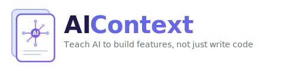

<p align="center">
  
</p>

<p align="center">
  <a href="https://www.npmjs.com/package/@zahardev/aicontext"></a>
  <a href="https://www.npmjs.com/package/@zahardev/aicontext"></a>
  <a href="LICENSE"></a>
</p>

**Your AI writes code. AIContext teaches it to build features.**

Most AI coding sessions lose context, skip planning, and need constant hand-holding. AIContext gives your AI assistant a complete development methodology — it interviews you before coding, creates a plan, executes it step by step with automated reviews and tests, and picks up exactly where it left off when you start a new session.

**Works with any language or framework** — PHP, Python, JavaScript, TypeScript, Rust, Go, and more.

**Supports multiple AI tools** — Claude Code, Codex, Cursor, and GitHub Copilot.

## Quick Start

```bash
npm install -g @zahardev/aicontext
cd /path/to/your-project
aicontext init
```

Then start a session: type `/start` (Claude Code) or `use start` (Codex, Cursor, Copilot). The AI will analyze your codebase and generate project context automatically.

Run `/aic-help` (or `use aic-help`) for a guided tour of available workflows and best practices.

## What Makes AIContext Different

### Not just context files — a Spec Driven Development workflow

Writing a `CLAUDE.md` or `.cursorrules` file gives your AI memory. AIContext gives it a **way of working** — built on [Spec Driven Development](https://martinfowler.com/articles/exploring-gen-ai/sdd-3-tools.html), where the spec is the source of truth and code is derived from it:

```text
/start-feature  →  Interview  →  Spec + Task(s)
                                      ↓
                                /run-task  →  Implement + Review + Test (automated per step)
                                      ↓
                                /finish-task  →  Sync docs, update worklog, handle git
```

**The AI interviews you** before writing code — exploring your codebase to avoid asking what it can determine itself. It recommends answers based on what it found, walks every dimension breadth-first so nothing is missed, and captures decisions as it goes. You confirm or correct — not explain from scratch.

**The AI executes the plan** — each step is implemented, reviewed, and tested automatically. You supervise rather than drive.

**The AI reviews its own code** — built-in review catches bugs, security issues, and architectural problems before you even look at the diff.

**The AI tests in the browser** — `/web-inspect` opens real pages, checks console errors, interacts with elements, and captures screenshots. No more copy-pasting console errors.

**The AI drives the process** — after every action, the AI tells you what to do next. Finished a step? "Run `/next-step` to continue." Closed a task? "Spec has more pending tasks — start the next one?" You never have to guess the next command.

**The AI adapts to your workflow** — on first run, it asks how you like to work: reviews after every step or only at the end? Commit per step or per task? Push automatically? It remembers your answers and never asks again.

**The AI remembers across sessions** — specs, tasks, and briefs capture everything. Start a new session, run `/check-task`, and the AI picks up where it left off. No knowledge is lost.

### Three layers of persistent context

| Layer | What it captures | Example |
|-------|-----------------|---------|
| **Spec** | What to build and why — requirements, decisions, non-goals | "Users can reset passwords via email. Not supporting SMS." |
| **Task** | How to build it — step-by-step plan with checkboxes | "Step 1: Add reset endpoint. Step 2: Email template. Step 3: Token expiry." |
| **Task-Context** | What the AI learned while building — patterns, gotchas, file references | "Auth middleware checks token in header, not cookie. See `src/auth.js:42`." |

Specs and tasks are committed to git. Task-context files are gitignored — each developer accumulates their own working knowledge.

Learn more in the [development model guide](docs/development-model.md).

## Key Features

### Structured planning
- `/start-feature` — thorough discovery interview before any code is written
- `/create-task` — quick task creation from conversation when a full interview isn't needed
- `/plan-tasks` — break an existing spec into multiple tasks
- `/add-idea` — capture a deferred idea to the worklog mid-session so it's not lost

### Automated execution
- `/run-task` — execute all steps with built-in review and test loops
- `/run-step` — execute a single step with full control
- `/do-it` — turn a conversation into a task step and implement it immediately

### Code review
- `/review` — quick correctness scan (bugs, security, edge cases)
- `/deep-review` — comprehensive architecture + correctness + codebase health review
- Specialized reviewer agent runs in parallel without consuming your main conversation (Claude Code)

### Session continuity
- `/check-task` — read spec, task-context, and task to resume exactly where you left off
- `/finish-task` — close out a task: sync spec, write completion notes, handle git
- `/align-context` — sync all context files with current state

### Issue & PR workflow
- `/draft-issue` — draft a GitHub issue from conversation context, optionally create it on GitHub directly
- `/draft-pr` — generate PR description from task context and git history
- `/gh-review-fix-loop` — automate the review-fix-push cycle (works with CodeRabbit, human reviewers, etc.)
- `/gh-fix-tests` — fix failing CI checks automatically: diagnose, fix, push, retry until green

### Thinking tools
- `/interview` — structured discovery on any topic — the AI walks dimensions, recommends answers, and captures decisions
- `/brainstorm` — generate missing angles, better implementations, and new combinations
- `/thoughts` — quick "what do you think?" check-in for feedback mid-conversation

### Browser inspection
- `/web-inspect` — open pages, check console errors, interact with elements, capture screenshots

### Safety guardrails
- Blocks destructive commands, enforces TDD, requires explicit permission before implementation
- Configurable quality checks: what runs after each step vs after the whole task — adapts to your preferences

See the [full skills reference](docs/skills.md) for detailed descriptions of all skills.

## How It Works

AIContext creates a `.aicontext/` directory with shared rules, prompts, and templates. Each AI tool gets a thin entry point that loads this shared context:

| Tool | How to invoke skills |
|------|---------------------|
| Claude Code | `/skill-name` (e.g., `/start-feature`) |
| Codex, Cursor, Copilot | `use skill-name` (e.g., `use start-feature`) |

Claude Code gets the richest experience with `/command` skills and parallel subagents. All tools share the same underlying prompts and instructions.

## Installation

### npm (Recommended)

```bash
npm install -g @zahardev/aicontext
cd /path/to/your-project
aicontext init
```

Or use npx for one-time setup: `npx @zahardev/aicontext init`

### Manual Copy

Clone the [GitHub repository](https://github.com/zahardev/aicontext) and copy the files you need:

```bash
git clone https://github.com/zahardev/aicontext.git /tmp/aicontext
cd /path/to/your-project
cp -r /tmp/aicontext/.aicontext .
cp -r /tmp/aicontext/.claude .    # Claude Code
cp -r /tmp/aicontext/.codex .     # Codex
cp -r /tmp/aicontext/.cursor .    # Cursor
cp -r /tmp/aicontext/.github .    # GitHub Copilot
rm -rf /tmp/aicontext
```

### Updating

```bash
aicontext update    # Update framework files (preserves your project-specific files)
aicontext upgrade   # Upgrade the CLI tool itself
```

## For Teams

| Committed to git | Gitignored |
|------------------|------------|
| Rules, prompts, templates, specs, tasks | Briefs, reviews, PR drafts, personal settings |

Team members share the same rules and task history. Each person's briefs and preferences stay local. See [project structure](docs/development-model.md#project-structure) for details.

## Customization

One config file controls how the AI works — no prompt engineering needed:

- **Project settings**: Edit `.aicontext/config.yml` (review/test/commit behavior, task naming, update checks)
- **Personal overrides**: Create `.aicontext/config.local.yml` (gitignored, overrides shared settings)
- **Team rules**: Edit `.aicontext/project.md`
- **Personal rules**: Edit `.aicontext/local.md` (gitignored)
- **Remove unused tools**: Delete `.cursor/`, `.codex/`, `.github/`, or `.claude/` as needed

## Learn More

- [Development Model](docs/development-model.md) — how specs, tasks, briefs, and quality checks work together
- [Workflow Guide](docs/workflow.md) — step-by-step guides for common workflows
- [Skills Reference](docs/skills.md) — detailed descriptions of every skill

## Version History

| Version | Highlights |
|---------|------------|
| **1.7.0** | Adaptive workflow — the AI learns your preferences and stops asking. GitHub issue creation. Thinking tools (`/interview`, `/brainstorm`, `/thoughts`). Automated CI fix (`/gh-fix-tests`). Ideas backlog. Smarter interviews that recommend answers. |
| **1.6.0** | The big workflow release — three-layer context (spec/task/task-context), structured planning, automated execution with review and test loops, PR automation, browser inspection with `/web-inspect`. |
| **1.5.0** | Codex support, `/draft-issue`, tool-agnostic PR scripts. |
| **1.4.0** | Slash command skills, PR workflow scripts, agent model upgrades to sonnet/opus. |
| **1.3.0** | Claude Code subagents — reviewer, researcher, test-runner working in parallel. |
| **1.2.0** | Auto-update checking, `aicontext upgrade`, `.ai/` → `.aicontext/` rename. |
| **1.0.0** | Initial release — rules, prompts, templates, multi-tool support. |

See [CHANGELOG.md](CHANGELOG.md) for full details.

## License

MIT
